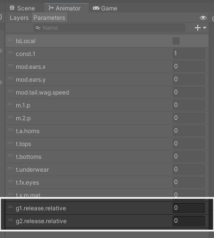

= How-To

== Animating with GottaGo

Both of GottaGo's subsystems expose a number of parameters that are intended to
be used to drive avatar-specific animations.

These parameters are outlined in the xref:how-to.adoc#sync-params[system docs].

For a parameter to be used in your own animation controller, that parameter must
first be declared in the animation controller's parameter list:

Once added to the animator, the parameters may be used like any others in
building your avatar's animation layers.  The parameters will be driven by the
GottaGo subsystem(s) when playing.