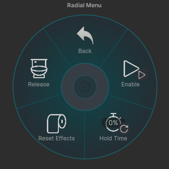

= GottaGo Bathroom Needs System
:repo-url: https://github.com/puddlefluff/VRC-GottaGo-System
:doc-url: https://puddlefluff.github.io/VRC-GottaGo-System
:icons: font
ifdef::env-github[]
:tip-caption: :bulb:
:note-caption: :information_source:
:important-caption: :heavy_exclamation_mark:
:caution-caption: :fire:
:warning-caption: :warning:
endif::[]

Parameter driver engine for building avatar animation systems around simulated
bodily functions.

GottaGo is primarily intended for use in creating kink-based VRChat avatar
customizations.  Please make sure you are familiar with VRChat's rules and
guidelines for acceptable content before building something from this system.

link:{doc-url}/system.html[Documentation]

[IMPORTANT]
--
This system *does not* provide any visible functionality for VRC avatars on its
own.

It is intended to be used by avatar artists and modders as a foundation for
building avatar/base specific animation systems.
--

== How to Use

=== Prerequisites

+1.+ https://vrcfury.com/[VRCFury]::
VRCFury components are attached to the bladder and bowels subsystem prefabs to
simplify the process adding the functionality to the parent avatar. +
+
The system's core functionality does not use VRCFury, and may be attached to an
avatar manually if desired to avoid the use of VRCFury.

=== Attach the System

The `.unitypackage` file available from the {repo-url}/releases/latest[latest release]
contains 5 prefab options:

. *GGBladder* - The bladder subsystem with {doc-url}/system.html#_contacts[contact receivers]
  that alter the system speed.
. *GGBladder-NoContacts* - The bladder subsystem without contact receivers.
. *GGBowels* - The bowels subsystem.
. *GGFull* - The bladder subsystem with contacts and the bowels subsystem.
. *GGFull-NoContacts* - The bladder subsystem without contacts and the bowels
  subsystem.

Attach one of the above prefabs to the root of your avatar for the default setup
using the default menus.

=== Customize Your Avatar

Once the system is attached, the parameters it drives may be used in your
avatar's animator to trigger or step through your own animations and effects.

==== Example Ideas

Ideas for things that could be driven by or connected to GottaGo.

+1.+ Full Bodily Needs::

Ditch the included menu, and run GottaGo through a hunger/thirst system to
simulate bodily needs for a detailed survival system.

+2.+ Notifications::

Trigger visual or audio cues based on current system 'pressure' to indicate how
badly your avatar needs to go.

+3.+ Pee on Things::

Tie some animation indicating urination to GottaGo's releasing indicator to pee
on all the things (when your bladder is full enough to do so).

+4.+ Embarassing Situations::

Humiliate yourself by not relieving that building pressure in time with a potty
dance or worse 😈

== Defaults

Default/built-in components.

=== Default Menus

.Outer Menu

.Full Prefab Inner Menu

.Subsystem Settings

